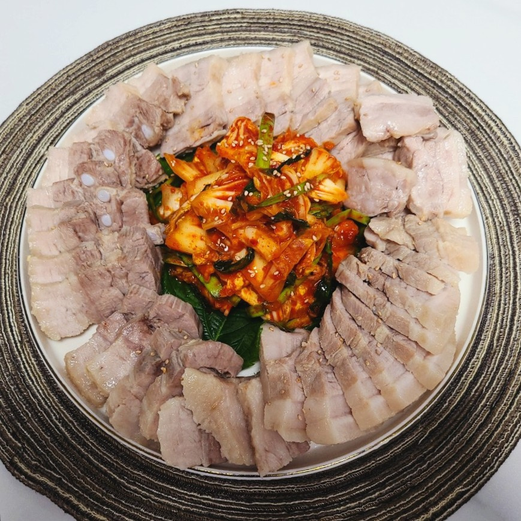

# 첫 번째 제목 (가장 큰 제목 (h1))
(#) 으로 표현 (많이 붙힐수록 작아짐)

--- 

## 글자 서식 적용하기

**진하게**

*기울임*

***굵게 기울임***

~~취소선~~

---

### 인용문 표현하기
> 인용문
>> 인용문 안에 인용문이 들어감

---

### 블렛 표현하기
- 블렛 표현1
- 블렛 표현2

---

### 숫자 리스트
1. first
2. second

---

### 코드 넣기
벡틱으로 표현 ` `

`function add(x, y) return x + y;`

---

### 하이퍼 텍스트 넣기
https://www.google.com

[구글로 연결](https://www.google.com)

[구글로 연결](https://www.google.com, 검색사이트)

---

### 이미지 삽입하기
#### 1. 링크로 삽입하기

[등갈비 동영상](https://www.youtube.com/watch?v=LWpEdwJV45E)

#### 2. 깃에 올려 삽입하기

---

### 테이블 만들기
|Header|Header2|

|content1|contents2|
|content1|contents2|
|content1|contents2|

